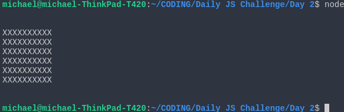
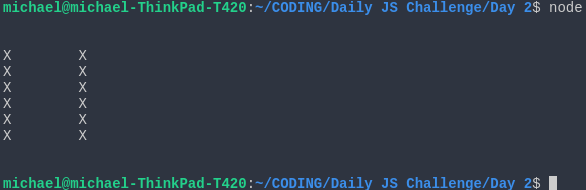
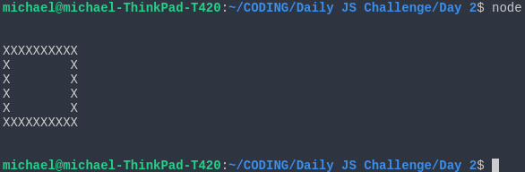
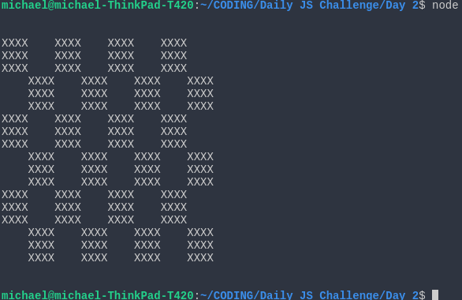

## Day 2 JS Challenge

Create a file called `Day2-task[x].js` where [x] is the task number. Implement your solution 
and then run it the usual way in Node.js `node Day2-task[x].js`. 

### Task 1

Create a program that when run will give the following output in the console:

### Task 2

Create a program that when run will give the following output in the console:

### Task 3

Create a program that when run will give the following output in the console:

### Task 4

What I want for Xmas? Chessboard! (Hint: try to use functions)

### Good luck folks!

